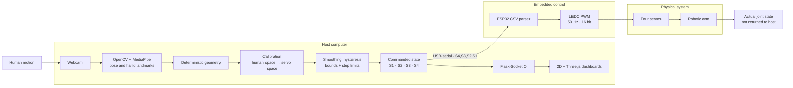

# Gesture-Controlled Robotic Arm

**Real-time human-to-robot teleoperation using monocular computer vision, calibrated joint mapping, ESP32 servo actuation, and synchronized software visualization.**

[](requirements.txt)
[](vision/camera.py)
[](vision/handtracking.py)
[](controller%20code/esp32-control-code/esp32-control-code.ino)
[](LICENSE)

This repository contains a working human-in-the-loop robotics prototype: a webcam observes upper-body and hand motion, host-side software turns those observations into bounded servo commands, and an ESP32 drives a physical four-servo arm. The same command stream is published to browser-based 2D and Three.js views for inspection and tuning.

MediaPipe supplies learned pose and hand perception. The current control policy is deterministic geometry, calibration, hysteresis, smoothing, and per-update limits—not an autonomous planner or learned action policy. The visualizations show **commanded state**; without joint sensors, they do not independently verify the arm's physical state.

> **Deep dive:** [Read the full technical overview](docs/TECHNICAL_OVERVIEW.md) for the perception geometry, calibration equations, filtering, runtime design, ESP32 protocol, kinematics experiments, safety analysis, and research roadmap.

## What works today

- A mirrored webcam feed captures the operator's upper body and hand.
- MediaPipe Tasks estimates right-arm pose landmarks and one hand's landmarks.
- Deterministic geometry derives elbow, shoulder, base, and pinch control quantities.
- Live calibration maps human motion into restricted, mechanism-specific servo ranges.
- Adaptive smoothing, gripper hysteresis, bounds, and per-update limits stabilize commands.
- Python sends `S4,S3,S2,S1` packets over USB serial; the ESP32 produces four 50 Hz PWM outputs.
- Flask-SocketIO mirrors command state to a 2D dashboard, Three.js views, and a live tuning page.

The repository also includes the production ESP32 sketch, isolated servo bring-up sketches, Fusion 360 assembly archives, experimental IK paths, and hardware-independent development modes.

## System architecture



The host is a soft real-time, latest-frame pipeline: camera acquisition and landmark inference run independently while the main loop consumes the newest available result. Browser clients and the ESP32 receive the same conditioned command state, but only the software branch is observable by the host.

## Why it is technically interesting

| Engineering problem | Current approach | Honest boundary |
| --- | --- | --- |
| Noisy or missing monocular landmarks | visibility gates, finite-value checks, cached points, previous-command fallback | 2D perception cannot recover metric depth |
| Human and robot kinematics do not match | per-joint transfer functions and restricted calibration ranges | each physical build still needs tuning |
| Small perception changes can cause actuator jitter | adaptive exponential smoothing and pinch hysteresis | filtering introduces response latency |
| Tracking jumps can create unsafe command steps | 5° S2/S3 and 3° S4 maximum update changes | limits are per update, not time-normalized |
| Vision and actuation run at different rates | threaded latest-frame processing and shared state | this is soft real-time, not deterministic real-time control |
| Software values must become embedded outputs | explicit CSV contract and ESP32 LEDC mapping | firmware currently trusts the host packet |
| Command does not prove physical motion | synchronized command-state dashboards | no encoder, force, torque, or collision feedback exists |

## Implementation status

| Implemented | Experimental | Planned / research direction |
| --- | --- | --- |
| Webcam acquisition and mirrored preview | Planar two-link inverse kinematics | Measured joint-position feedback |
| MediaPipe pose and hand tracking | Alternative vector shoulder mapping | Identified physical FK and constrained 3D IK |
| Calibrated deterministic joint mapping | Telemetry-derived IK dashboard | Depth and object-pose perception |
| Adaptive smoothing and step limiting | Browser-only semi-IK workspace explorer | Closed-loop visual servoing |
| Pinch-latched and manual gripper control | Scripted pick-and-place visualization | Firmware bounds and command watchdog |
| ESP32 serial-to-servo actuation | Gesture-development notebooks | Collision-aware trajectory planning |
| 2D/3D command visualization and live tuning | Camera-based IK overlay without actuation | ROS 2 and learned/shared-autonomy research |

Experimental entries are isolated from the production actuation path unless explicitly stated. Planned items describe research direction, not current capability.

## Key engineering decisions

- **Learned perception, deterministic control.** MediaPipe estimates landmarks; explicit geometry and calibration generate actions.
- **Calibration is part of the controller.** Human angles are transferred into narrower robot ranges instead of copied directly.
- **Process the newest frame.** Acquisition and inference share the latest result rather than accumulating stale frames in a queue.
- **Condition commands before transport.** Validation, smoothing, hysteresis, clamping, and step limits live on the host.
- **Keep embedded responsibilities small.** The ESP32 parses a four-angle packet and maps it to LEDC PWM channels.
- **Name the observable state correctly.** The dashboards form a command-state digital twin, not feedback-validated physical state.

## Technology stack

| Layer | Technologies | Responsibility |
| --- | --- | --- |
| Perception | Python, OpenCV, MediaPipe Tasks, NumPy | image capture, landmarks, geometry, validation |
| Host control | Python, threading, PySerial | calibration, conditioning, concurrent runtime, transport |
| Web observability | Flask, Flask-SocketIO, Eventlet | live state, tuning, browser routes |
| Visualization | HTML, CSS, JavaScript, Three.js | 2D telemetry and simplified 3D kinematics |
| Embedded | ESP32, Arduino C++, LEDC PWM | serial parsing and four-channel servo output |
| Mechanical | Autodesk Fusion 360 archives | arm, gripper, and combined assembly designs |

## Repository map

```text
gesture-controlled-robotic-arm/
├── main.py                         # implemented vision → dashboard/serial runtime
├── calibration.py                  # calibration defaults and validation
├── requirements.txt                # pinned host dependencies
├── pose_landmarker*.task           # MediaPipe pose model assets
├── hand_landmarker.task            # MediaPipe hand model asset
├── vision/
│   ├── camera.py                   # mirrored OpenCV acquisition
│   ├── handtracking.py             # pose + hand inference
│   ├── gesture_model.py            # geometry, mapping, filtering, constraints
│   └── gesture_model_vector.py     # experimental shoulder mapping
├── dashboard/
│   ├── server.py                   # Flask-SocketIO state and routes
│   └── templates/                  # 2D, Three.js, IK, tuning, simulation views
├── controller code/
│   └── esp32-control-code/
│       └── esp32-control-code.ino  # production CSV → LEDC firmware
├── esp32-test codes/               # isolated hardware bring-up sketches
├── ik_pipeline/                    # experimental planar IK components
├── main_ik_experimental.py         # camera-based IK overlay experiment
├── main_vector_experimental.py     # non-serial vector-mapping experiment
├── cad-model/                      # Fusion 360 arm and gripper archives
├── gesturedetection-trial/         # exploratory MediaPipe notebooks
└── docs/
    └── TECHNICAL_OVERVIEW.md       # complete engineering documentation
```

## Quick start

The repository does not specify a tested Python version. Choose a Python release compatible with the pinned packages in [`requirements.txt`](requirements.txt).

```bash
git clone https://github.com/adithya-a-labs/gesture-controlled-robotic-arm.git
cd gesture-controlled-robotic-arm
python -m venv .venv
```

Activate the environment with `\.venv\Scripts\Activate.ps1` on Windows PowerShell or `source .venv/bin/activate` on macOS/Linux, then install the dependencies:

```bash
python -m pip install --upgrade pip
python -m pip install -r requirements.txt
```

### Run without physical hardware

The primary runtime supports a hardware-disabled development path.

1. Set `USE_SERIAL = False` near the top of [`main.py`](main.py).
2. Run `python main.py` from the repository root.
3. Open [http://localhost:5000/3d-fk](http://localhost:5000/3d-fk) for the FK command view or [http://localhost:5000/tune](http://localhost:5000/tune) for live calibration.
4. Press <kbd>Esc</kbd> in the OpenCV window to stop.

Computed packets are printed as `[DEV MODE]`; a serial-open failure at startup also falls back to this behavior. A webcam and desktop display are still required by `main.py`.

### Run with the physical arm

1. Flash [`controller code/esp32-control-code/esp32-control-code.ino`](controller%20code/esp32-control-code/esp32-control-code.ino) to the ESP32.
2. Connect the four servo signal lines to the documented GPIOs, use an external regulated 5 V servo supply, and connect its ground to ESP32 ground.
3. Set `USE_SERIAL = True` and replace the current `COM5` port in [`main.py`](main.py) with the ESP32's assigned serial port.
4. Confirm conservative, collision-free calibration ranges before running `python main.py`.

Read the [full hardware, wiring, calibration, and startup procedure](docs/TECHNICAL_OVERVIEW.md#run-with-the-physical-robot) before energizing the mechanism.

## Safety and limitations

> This is an experimental research prototype, not a certified safety system.

- Servos can move unexpectedly when mappings, wiring, orientation, or calibration are incorrect.
- Start with conservative limits, no payload, a clear swept volume, and a physical means to remove servo power.
- Power the servos from a correctly sized external regulated supply—not the ESP32—and use a common ground.
- The host has no physical joint-position, force, torque, or collision feedback.
- Dashboard state represents requested commands and is not independent evidence that the mechanism reached them.
- The production firmware has no input bounds, timeout, or watchdog; the host currently carries the command protections.
- Monocular 2D landmarks are affected by framing, perspective, occlusion, and out-of-plane motion.
- No collision avoidance, autonomous task planner, or closed-loop visual servoing is implemented.

See the [complete safety and known-limitations discussion](docs/TECHNICAL_OVERVIEW.md#safety-and-known-limitations).

## Documentation

- [Full technical overview](docs/TECHNICAL_OVERVIEW.md)
- [System and runtime architecture](docs/TECHNICAL_OVERVIEW.md#system-architecture)
- [Vision and geometric control](docs/TECHNICAL_OVERVIEW.md#vision-and-geometric-control)
- [Human-to-robot calibration](docs/TECHNICAL_OVERVIEW.md#human-to-robot-calibration)
- [Signal conditioning and control stability](docs/TECHNICAL_OVERVIEW.md#signal-conditioning-and-control-stability)
- [ESP32 control and physical mechanism](docs/TECHNICAL_OVERVIEW.md#control-contract-and-physical-mechanism)
- [Synchronized visualization and forward kinematics](docs/TECHNICAL_OVERVIEW.md#synchronized-visual-model-and-forward-kinematics)
- [Inverse kinematics and mapping experiments](docs/TECHNICAL_OVERVIEW.md#experimental-control-paths)
- [Evaluation framework](docs/TECHNICAL_OVERVIEW.md#evaluation-framework)
- [Research roadmap](docs/TECHNICAL_OVERVIEW.md#research-roadmap)
- [Safety and known limitations](docs/TECHNICAL_OVERVIEW.md#safety-and-known-limitations)

## Contributors

- [Adithya A](https://github.com/adithya-a-labs)
- [Rohan Skaria](https://github.com/skariarohan)
- [Aryan Sajan Nair](https://github.com/Ar27-25)
- [Medicherla Satya Kalyana Bhairava Mukesh](https://github.com/Satya2508)

## License

Released under the [MIT License](LICENSE). Copyright © 2026 Adithya A, Rohan Skaria, Aryan Nair, and M Satya.
